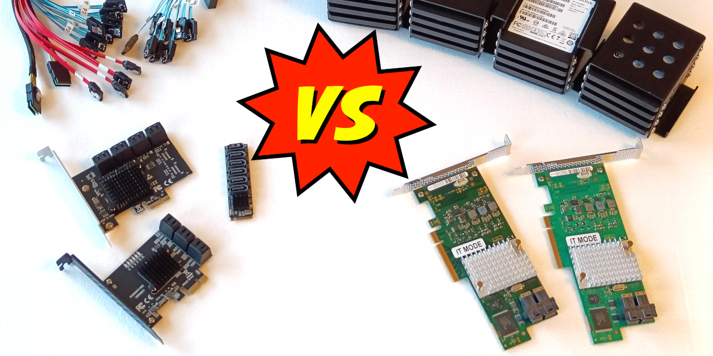
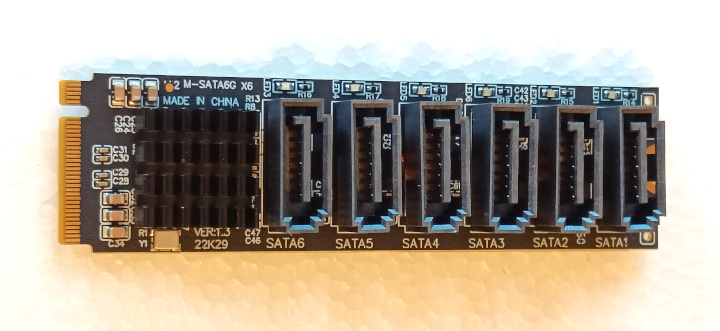

# SATA controllers vs HBAs

_Comparing apples to oranges for your homelab project._

## But why?

Being very charmed by the [10" racks showing up](https://www.reddit.com/r/minilab/), I started planning one as well. As my idea involves ZFS bulk storage pools, I wanted to connect multiple 2.5" SATA SSDs as a decent tradeoff for their dimensions, capacity and cost.

Between [ICY DOCK](https://global.icydock.com/products-c4-s50-i0.html) and [some 3D printing](https://github.com/geerlingguy/mini-rack/issues/10), I'm sure the enclosure is something we can already solve today, and will get more options.

What about the controller? For a mITX build you can find motherboards with 4-6 SATA ports, but I'm looking to use a Mini PC.

 
Would you look at that! Cheap tiny M.2 boards with SATA ports on 'em! Perfect?

No! Says the ZFS community. Generally these controllers will get discouraged, linking this thread. 
https://forums.truenas.com/t/multiply-your-problems-with-sata-port-multipliers-and-cheap-sata-controllers/1504

The main points:

-   They may lack bandwidth to run all drives.
-   They use command-based / FIS-based port multiplying, which is unreliable for ZFS use.
-   Some vendors sell knock-off controllers or insufficiently cooled versions.
-   An LSI based HBA is recommended instead.

So that's that right? Just pick up an HBA! Except that they're substantially larger cards for a small build and require active cooling to dissipate the heat. You will burn your fingers and cook the card if you don't.

To use this with a mini PC, you need to accommodate:

-   An external PSU
-   A cooling fan
-   PCIe risers of some kind

Thinking about it for a while, I decided there was but one correct choice.
Obtain all of the above and test it!
