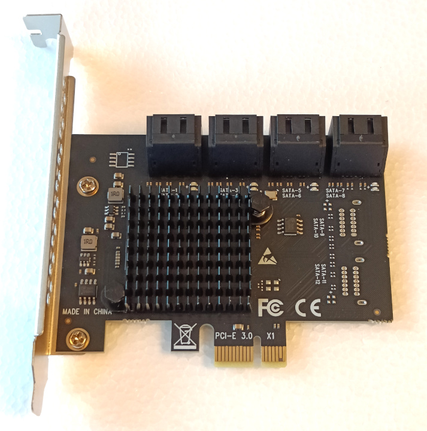

# SATA controllers vs HBAs

_Comparing apples to oranges for your homelab project._

Here I'm looking to **stress test and benchmark** several controller and HBA options, intended for SATA SSD ZFS pools in a 10" mini-rack.

Have a controller or test you want to see?
Request it in the [GitHub issues](https://github.com/Beanow/satactl-vs-hba/issues).

## But why?

Being very charmed by the [10" racks showing up](https://www.reddit.com/r/minilab/), I started planning one as well. As my idea involves ZFS bulk storage pools, I wanted to connect multiple 2.5" SATA SSDs as a decent tradeoff for their dimensions, capacity and cost.

Between [ICY DOCK](https://global.icydock.com/products-c4-s50-i0.html) and [some 3D printing](https://github.com/geerlingguy/mini-rack/issues/10), I'm sure the enclosure is something we can already solve today, and will get more options.

What about the controller? For a mITX build you can find motherboards with 4-6 SATA ports, but I'm looking to use a Mini PC.

 
Would you look at that! Cheap tiny M.2 boards with SATA ports on 'em! Perfect?

No! Says the ZFS community. Generally these controllers will get discouraged, linking this thread. 
https://forums.truenas.com/t/multiply-your-problems-with-sata-port-multipliers-and-cheap-sata-controllers/1504

The main points:

-   They may lack bandwidth to run all drives.
-   They use command-based / FIS-based port multiplying, which is unreliable for ZFS use.
-   Some vendors sell knock-off controllers or insufficiently cooled versions.
-   An LSI based HBA is recommended instead.

So that's that right? Just pick up an HBA! Except that they're substantially larger cards for a small build and require active cooling to dissipate the heat. You will burn your fingers and cook the card if you don't.

To use this with a mini PC, you need to accommodate:

-   An external PSU
-   A cooling fan
-   PCIe risers of some kind

Thinking about it for a while, I decided there was but one correct choice.
Obtain all of the above and test it!

## Components

Here are the test parts I have currently.
I'd consider adding more if there's a demand for it.

### Fujitsu D3307-A12 (2x)

SAS3008 based HBA in IT mode. 
Comparable to an [LSI 9300-8i](https://docs.broadcom.com/doc/12354877).

PCIe 3.0 x8 card to 2x SFF-8643 (Mini-SAS HD). 
Includes low-profile bracket. 
Can support SATA 6Gb/s or SAS 12Gb/s.

Price €50 (used).

### M.2 with ASM1166 6-port controller (1x)

[ASM1166](https://www.asmedia.com.tw/product/45aYq54sP8Qh7WH8/58dYQ8bxZ4UR9wG5) based SATA controller (assuming it's not a knockoff).

M-Key M.2 to 6x SATA 6Gb/s ports. 
PCIe 3.0 x2 based chip, _untested what link speed we get_.

Price €26,39 ([aliexpress](https://aliexpress.com/item/1005007177101138.html)) 
Included a set of optional SATA cables.

### PCIe ASM1166 6-port controller (1x)

[ASM1166](https://www.asmedia.com.tw/product/45aYq54sP8Qh7WH8/58dYQ8bxZ4UR9wG5) based SATA controller (assuming it's not a knockoff).

PCIe 3.0 x1 to 6x SATA 6Gb/s ports. 
Includes low-profile bracket. 
PCIe 3.0 x2 chip, _but limited to x1 physically?_

Price €24,19 ([aliexpress](https://aliexpress.com/item/1005005434680369.html))

### PCIe ASM1064 + JMB575 8-port controller (1x)

[ASM1064](https://www.asmedia.com.tw/product/A58yQC9Sp5qg6TrF/58dYQ8bxZ4UR9wG5) controller + [JMB575](https://www.jmicron.com/products/list/16) multiplier (assuming it's not a knockoff).

PCIe 3.0 x1 to 8x SATA 6Gb/s ports. 
**Without** low-profile bracket. 
ASM1064 being PCIe 3.0 x1 supporting 4x SATA ports, multiplied by the JMB575 up to 8x total ports.

Price €26,59 ([aliexpress](https://aliexpress.com/item/1005004936884946.html))

### SanDisk X400 128GB 2.5" SATA SSD (16x)

Used consumer grade SATA SSDs.
SMART lifespan between 91-99%.

I know these are not exactly "bulk storage", their purpose is to be cheap test subjects that can get close to saturating a SATA 6Gb/s link.

| Manufacturer ratings    |            |
| ----------------------- | ---------- |
| Flash type              | TLC        |
| DRAM-cache              | No         |
| Read (seq)              | 540MB/s    |
| Write (seq)             | 340MB/s    |
| Read (random 4K, QD32)  | 93.500IOPS |
| Write (random 4K, QD32) | 60.000IOPS |

Price €8 per disk (used)

### Various PCIe / M.2 / OCuLink risers

Adding details as I move to testing those.
